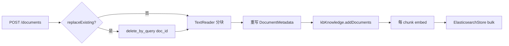

# 入库链路优化指南

本文档基于 `03-simple-es-code` 当前入库实现，结合 **AgentScope Java RAG** 能力边界，对「删旧 chunk → TextReader 分块 → 绑定 doc_id → addDocuments」链路给出可落地的优化建议。

| 项 | 说明 |
|----|------|
| 关联工程 | [README.md](./README.md)（运行与 API）、[README-vES.md](../README-vES.md)（方案设计） |
| 核心类 | `IngestService`、`ElasticsearchDocMaintenance`、`SimpleKnowledge`、`ElasticsearchStore` |
| 对话来源 | 入库优化专项讨论（会话 `02dd3abe-603c-4ffa-9741-9d25e8bc6d21`） |

---

## 目录

1. [当前链路与瓶颈](#当前链路与瓶颈)
2. [优化优先级总览](#优化优先级总览)
3. [分步骤优化](#分步骤优化)
4. [场景化推荐组合](#场景化推荐组合)
5. [仅改配置可尝试项](#仅改配置可尝试项)
6. [不建议 / 短期不做](#不建议--短期不做)
7. [落地路线图](#落地路线图)

---

## 当前链路与瓶颈

### 流程（与代码一致）



对应实现见 `IngestService.ingest`：

1. `replaceExisting=true` 时调用 `ElasticsearchDocMaintenance.deleteByDocId(docId)`
2. `TextReader.read(ReaderInput.fromString(body))` 分块
3. 为每个 chunk 设置业务 `doc_id`、`chunk_id`（`0,1,2…`）及 `payload`
4. `kbKnowledge.addDocuments(chunks).block()`

### 各步骤耗时与风险

| 步骤 | 现状 | 主要耗时 / 风险 |
|------|------|-----------------|
| 删旧 | 每次覆盖入库全量 `delete_by_query(doc_id)` | ES 尚可；**内容未变也会删** |
| 分块 | `TextReader` + `PARAGRAPH`，默认 1024 / overlap 50 | 策略单一，FAQ 与长文未区分 |
| 绑 ID | 覆盖 `doc_id`，`chunk_id` 为序号 | 稳定；**内容未变仍会重 embed** |
| `addDocuments` | `SimpleKnowledge` 内 **每个 chunk 一次 `embed()`** | **DashScope QPS / 费用**；大文档慢 |
| 写 ES | `ElasticsearchStore` **bulk** 一次写入 | 相对已较优 |

### AgentScope 侧事实

`SimpleKnowledge.addDocuments` 典型逻辑：

```text
Flux.fromIterable(docs)
  .flatMap(doc -> embeddingModel.embed(doc))   // 每 chunk 一次 DashScope
  .collectList()
  .flatMap(docs -> embeddingStore.add(docs))   // ES bulk
```

- **已优化**：Store 侧 bulk 写入。
- **未封装**：Knowledge 层无「批量 embed API」；`EmbeddingModel` 接口仅 `embed(ContentBlock)` 单条。
- **注意**：Reactor `flatMap` 默认可高并发 embed，易触发 DashScope 限流（429）。

`TextReader` 内部分块后会生成随机 `docId`，本工程在 read 后**强制覆盖**为业务 `doc_id`，做法正确。

---

## 优化优先级总览


| 优先级 | 方向 | 典型收益 |
|--------|------|----------|
| **P0** | 内容未变则跳过删 + embed | 省 API 费用、缩短入库时间 |
| **P0** | 稳定 `chunk_id` + 按块增量 | 大文档小改不必全量重算 |
| **P1** | 分块策略按场景配置 | 检索召回明显提升 |
| **P1** | chunk 上下文增强（标题/章节） | 减少断章取义 |
| **P2** | 批量 Embedding / 限流并发 | 吞吐与稳定性 |
| **P2** | 异步入库（202 + 任务状态） | HTTP 不长时间阻塞 |
| **P3** | `PdfReader` / `WordReader` / `TikaReader` | 多格式物料入库 |
| **P3** | 蓝绿索引 / 扩展 Store | 减少先删后写空窗 |

---

## 分步骤优化

### 3.1 删旧 chunk（`ElasticsearchDocMaintenance`）

**现状**：`replaceExisting=true` 时无条件 `delete_by_query(doc_id)`。

| 优化 | 做法 | 说明 |
|------|------|------|
| 按内容哈希跳过 | 请求带 `contentVersion` 或服务端对 `body` 算 `sha256`，与上次一致则直接返回 | 避免无意义删写 |
| 软删除 + 版本 | payload 增加 `version`、`status=active`；检索 filter 仅 active | 可审计、可回滚，需改检索侧 |
| 增量删块 | 仅删除不在新分块列表中的 `chunk_id` | 依赖稳定 chunk 规则（见 3.3） |
| 蓝绿索引 | 新数据写入 `index_v2`，别名切换 | 降低「先删后写」期间的检索空窗 |

AgentScope **未提供** `deleteByDocId`；本工程用 ES REST 补齐合理，优化重点在**减少 delete 调用次数**。

---

### 3.2 TextReader 分块

**现状**：全局 `agentscope.rag.simple.reader`：`chunk-size`、`split-strategy`、`chunk-overlap`。

| 优化 | AgentScope 能力 | 建议 |
|------|-----------------|------|
| 按文档类型选策略 | `SplitStrategy`: `PARAGRAPH` / `TOKEN` / `CHARACTER` | FAQ：`CHARACTER` 或小块；制度/手册：`PARAGRAPH`，用评测集对比 |
| 调 chunk / overlap | `TextReader(size, strategy, overlap)` | 条款、专有名词：减小 chunk、增大 overlap |
| 换 Reader | `PdfReader`、`WordReader`、`TikaReader` | API 支持文件路径/上传，而非仅 `text` 字符串 |
| 结构化 FAQ | 仍用 `TextReader`，格式化为「问/答/分类」模板 | 可加关键词行，便于日后混合检索 |
| 语义分块 | **无内置** semantic chunker | 需外部切分或自研，再 `addDocuments` |

**说明**：不必改 `TextReader` 生成随机 `docId` 的行为；入库后覆盖 `doc_id` 即可。

---

### 3.3 绑定 doc_id / chunk_id / payload

**现状**：`chunk_id = "0","1","2"…` 按本次分块顺序。

| 优化 | 做法 | 效果 |
|------|------|------|
| 稳定 chunk_id | `chunk_id = hash(段落文本)` 或 `hash(docId + 段落序号 + 段落hash)` | 小改文档时，未变段落可跳过 embed |
| payload 增强 | `version`、`ingestedAt`、`contentHash`、`source`、`mimeType` | 运维、过滤、增量判断 |
| 检索增强 | 入库文本前缀拼 `title`、章节标题 | 向量检索更准 |
| 确定性 ES 文档 | 保持 chunk 文本稳定，AgentScope 按 metadata 生成 Document id | 减少重复幽灵数据 |

这是在 AgentScope 模型之上**最能控制 Embedding 成本**的一层。

---

### 3.4 addDocuments（AgentScope 核心）

| 优化 | 层级 | 说明 |
|------|------|------|
| 批量 Embedding | 应用层 | DashScope SDK 支持 batch；可绕过 `SimpleKnowledge`：`embedBatch` → 写入向量 → `ElasticsearchStore.add()` |
| 限制并发 | 仍用 `addDocuments` | 若 fork AgentScope，对 `flatMap` 设 `concurrency(4)`，避免打满限流 |
| 只 embed 变更块 | 应用层 | 删旧前读 ES 旧 chunk 的 `contentHash`，未变块复用旧向量 |
| 分批 addDocuments | 应用层 | 每批 32～64 chunk，降低单次失败面、便于重试 |
| 异步 Mono | 应用层 | ingest 不 `.block()`，用 `@Async` / 队列；HTTP 返回 `taskId` |
| 扩展 SimpleKnowledge | 框架层（重） | PR：已带 `embedding` 的 Document 跳过 embed |

**结论**：AgentScope 已优化 Store bulk；主要优化在 **Embedding 调用次数**，而非 ES 写入。

---

### 3.5 ElasticsearchStore 写入

| 优化 | 说明 |
|------|------|
| 保持 bulk | 当前已一次 bulk，无需改 |
| 减少先删后写窗口 | 高并发读可能短暂查不到；可用双索引 + 别名切换 |
| 索引运维 | 数据量大时调 `refresh_interval`、分片数 |
| 覆盖代替全删 | 稳定 `_id` 时可用 index 覆盖，替代 delete_all |

---

## 场景化推荐组合

### 场景 A：FAQ / 短文档（当前主路径）

1. **P0**：`contentHash` 未变 → 跳过 ingest  
2. **P1**：FAQ 用较小 `chunk-size`，或 **一条 FAQ 一个 chunk**（整段入库）  
3. **P2**：批量 reload 时限流并发 embed（避免 DashScope 429）

### 场景 B：长制度 / Wiki

1. **P1**：`PARAGRAPH` + `overlap 50~100`，正文带标题层级  
2. **P0**：稳定 `chunk_id` + 只 embed 变更块  
3. **P2**：批量 embed 或分批 `addDocuments`  
4. **P3**：`TikaReader` / 文件上传接口  

### 场景 C：生产入库

1. **P2**：异步入库 + 状态查询 API  
2. **P0**：幂等（`docId + version`）  
3. 监控：embed 耗时、chunk 数、ES bulk 失败率、delete 条数  

---

## 仅改配置可尝试项

在 `application.yml` 中调整（无需改代码即可试验）：

```yaml
agentscope:
  rag:
    simple:
      reader:
        chunk-size: 512          # FAQ 可更小；长文可 1024~2048
        split-strategy: TOKEN      # 或 PARAGRAPH，用黄金集对比
        chunk-overlap: 80
```

FAQ 可尝试 **一问一答一个 chunk**（`chunk-size` 很大或文本本身很短），减少 embed 次数与检索噪声。

---

## 不建议 / 短期不做

| 项 | 原因 |
|----|------|
| 自研 ANN | 已有 ES kNN，重复建设 |
| 改 AgentScope `ElasticsearchStore` 内部 | 升级成本高，业务层补即可 |
| 一上来语义分块 | 复杂度高，先调好规则分块 + 评测 |
| 去掉全量 delete | 可与增量策略并存：增量失败再全量覆盖兜底 |

---

## 落地路线图

建议按投入产出分三期：

| 阶段 | 内容 | 改动面 |
|------|------|--------|
| **一期（P0）** | `contentHash` 跳过无变更入库；FAQ 单 chunk 策略 | `IngestService` + 可选本地/ES 缓存 hash |
| **二期（P1）** | 稳定 `chunk_id`、payload 增强、分块配置按类型 | `IngestService`、配置、`DocumentIngestRequest` |
| **三期（P2/P3）** | 批量 embed 管道、异步入库、多格式 Reader | 新 `IngestPipeline`、任务表、文件 API |

### 一句话总结

- **AgentScope 已做好**：Reader 分块、`SimpleKnowledge` 编排、ES bulk 写入。  
- **本工程最该优化**：少删、少 embed（哈希 / 稳定 chunk_id / 增量）、分块与正文增强（效果）、批量与异步（性能）。  
- **最大成本**：`addDocuments` 内每 chunk 一次 Embedding；优先在应用层做批量 embed 或跳过未变 chunk。

---

## 附录：相关源码位置

| 组件 | 路径 |
|------|------|
| 入库编排 | `src/main/java/io/agentscope/rag/kb/ingest/IngestService.java` |
| ES 删文档 | `src/main/java/io/agentscope/rag/kb/store/ElasticsearchDocMaintenance.java` |
| Reader 配置 | `src/main/java/io/agentscope/rag/kb/config/KnowledgeConfiguration.java` |
| 分块参数 | `src/main/resources/application.yml` → `agentscope.rag.simple.reader` |
| 上游参考 | AgentScope `SimpleKnowledge`、`ElasticsearchStore`、`TextReader` |
