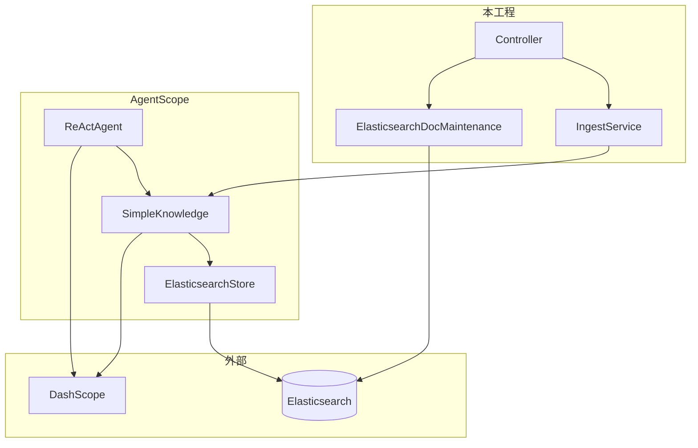
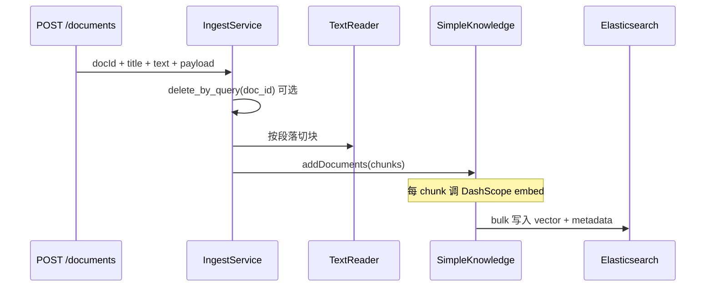

# SimpleKnowledge + Elasticsearch 知识库服务

把企业文档变成「可检索、可对话」的知识库：文本入库 → 向量写入 **Elasticsearch** → 提问时先检索再让大模型回答（RAG）。

| 项 | 值 |
|----|-----|
| 端口 | `8082` |
| 框架 | AgentScope Java `1.1.0-RC2` + Spring Boot 3.4 |
| 向量库 | `ElasticsearchStore`（默认，`store-type=elasticsearch`） |
| ES 索引 | `agentscope_kb`（可配置） |
| Embedding | DashScope `text-embedding-v3`，**1024 维** |
| 仓库 | https://github.com/qjli/agentscope-rag-es |

方案设计见 [README-vES.md](../README-vES.md)。入库链路优化见 [README-optimize.md](./README-optimize.md)。

---

## 目录

1. [一句话理解](#一句话理解)
2. [核心原理](#核心原理)
3. [代码审视结论](#代码审视结论)
4. [项目结构与关键类](#项目结构与关键类)
5. [配置说明](#配置说明)
6. [快速开始](#快速开始)
7. [API 说明](#api-说明)
8. [常见问题](#常见问题)
9. [与 02 对比](#与-02-simple-kg-code-对比)
10. [入库优化指南](./README-optimize.md)（独立文档）
11. [运维 UI](#运维-uifrontend)（`frontend/`）

---

## 一句话理解

**Spring 管 HTTP 和 `doc_id` 运维；AgentScope 管切块、向量化、检索；Elasticsearch 存向量并用 kNN 找相似段；DashScope 负责 Embedding 和对话。**

本工程**不实现**向量索引算法（无自研 ANN），向量检索由 ES + AgentScope `ElasticsearchStore` 完成。

---

## 核心原理

### 分层职责



| 层级 | 组件 | 职责 |
|------|------|------|
| 接入层 | `web/*Controller` | REST、参数校验（`@Valid`）、Swagger |
| 入库 | `IngestService` | 删旧 chunk → `TextReader` 分块 → 绑定 `doc_id` → `addDocuments` |
| 检索 | `KbRetrieveService` | 调用 `kbKnowledge.retrieve`，限制 `limit≤100` |
| 对话 | `KbChatService` + `ReActAgent` | GENERIC 下自动先检索再生成 |
| ES 运维 | `ElasticsearchDocMaintenance` | `delete_by_query`、`/_count`、ping（REST，补 SDK 缺口） |
| 向量库 | `ElasticsearchStore` | bulk 写入、`knn` 检索（`numCandidates=max(limit×2,50)`） |
| 编排 | `SimpleKnowledge` | 对每段文本 `embed` 后交给 Store |

### 入库链路



**三个 ID**：

| 字段 | 含义 |
|------|------|
| `doc_id` | 业务文档 ID，更新/删除粒度 |
| `chunk_id` | 分块序号 `0,1,2…` |
| ES `_id` | chunk 级 UUID（AgentScope 按内容生成） |

### 检索链路（kNN + 阈值）

1. 问题文本 → **Embedding** → 查询向量  
2. ES **kNN**：在 `dense_vector` 上找 Top-K（近似最近邻，由 ES/HNSW 完成）  
3. `SimpleKnowledge` 再按 **`scoreThreshold`**（默认 0.35）过滤  

**注意 `limit` 参数**：

- 业务含义：返回几条结果（Top-K）  
- AgentScope 内部：`numCandidates = max(limit × 2, 50)`  
- ES 限制：`num_candidates ≤ 10000` → 理论上 `limit` 不能超过 5000  
- 本服务 API：**`limit` 限制在 1～100**（`RetrieveRequest` + `KbRetrieveService`），避免误填导致 ES 报错  

### 对话链路（RAG）

- 默认 **`agentscope.agent.rag-mode: GENERIC`**：每次 `POST /chat` 会先检索知识库，再调用 `qwen-plus`  
- 对话用的检索参数来自 **`agentscope.agent.retrieve`**（默认 `limit: 3`），与 `/kb/retrieve` 的默认 `limit: 5` **相互独立**  
- 会话记忆为进程内 **`InMemoryMemory`**，**无 `sessionId` 持久化**（重启或多实例不共享）

### ES 索引字段（自动创建）

| 字段 | 说明 |
|------|------|
| `doc_id` / `chunk_id` | 逻辑 ID |
| `content` | 原文（TextBlock JSON） |
| `vector` | 1024 维，`cosine` |
| `payload` | 自定义元数据 JSON |

当前**仅 kNN 向量检索**，未做 BM25 混合检索。

---

## 代码审视结论

> 基于当前 `main` 分支实现（2026-05），供维护与扩展参考。

### 已做对的部分

| 点 | 说明 |
|----|------|
| 向量库选型清晰 | `StoreConfiguration` 一处切换 `ElasticsearchStore` / `InMemoryStore` |
| 统一入库 | FAQ 与通用文档都走 `IngestService`，避免两套逻辑 |
| 按 doc 更新 | ES 模式先 `delete_by_query` 再写入，避免重复 chunk 堆积 |
| Agent 装配 | `@DependsOn("kbKnowledge")`，避免 `ConditionalOnBean` 整类跳过 |
| 依赖版本 | `pom.xml` 锁定 ES 客户端 **9.3.3 + rest5-client**，避免 Spring Boot 8.x 缺 `Rest5Client` |
| 检索防护 | `limit` 上限 100，规避 `num_candidates` 超限 |
| 可观测 | Actuator + `KbElasticsearchHealthIndicator`（ES ping、文档数） |

### 当前局限（有意未做）

| 点 | 影响 |
|----|------|
| 同步阻塞入库/检索 | `addDocuments().block()`，大文档会占用 HTTP 线程 |
| 无鉴权 | 所有 API 对可达网络开放，生产需网关或 Spring Security |
| 无混合检索 / Rerank | 专有名词、错误码场景召回可能偏弱 |
| `store-type=memory` | 不支持按 `doc_id` 删除，重复入库会叠 chunk |
| 双连接 ES | `ElasticsearchStore`（SDK）+ `ElasticsearchDocMaintenance`（JDK HttpClient）各一条 |
| 内存会话 | 多轮指代、跨实例会话需后续自建会话服务 |
| `KbIndexRegistry` 计数 | 与 ES `_count` 可能不一致；**以 `/status` 的 `elasticsearchDocumentCount` 为准** |

### 安全提醒

- **勿将真实 `DASHSCOPE_API_KEY` 写入 `application.yml` 并提交 Git**；请用环境变量 `export DASHSCOPE_API_KEY=...`  
- `application.yml` 默认仅为占位符 `sk-your-dashscope-api-key`

---

## 项目结构与关键类

```
src/main/java/io/agentscope/rag/kb/
├── SimpleKbApplication.java
├── config/
│   ├── StoreConfiguration.java      # elasticsearchStore / kbVectorStore
│   ├── KnowledgeConfiguration.java  # kbKnowledge, TextReader, RetrieveConfig
│   ├── ReActAgentConfiguration.java # kbAssistantAgent
│   └── SimpleRagProperties.java     # store-type, es, reader, retrieve
├── ingest/IngestService.java        # 入库核心
├── retrieve/KbRetrieveService.java
├── chat/KbChatService.java
├── store/ElasticsearchDocMaintenance.java
├── faq/FaqBootstrapAdapter.java     # FAQ → IngestService
└── web/                             # REST + DTO + GlobalExceptionHandler
```

| 包 | 关键 Bean / 类 |
|----|----------------|
| `config` | `kbKnowledge`, `elasticsearchStore`, `kbAssistantAgent` |
| `ingest` | `IngestService`, `DocumentIngestRequest` |
| `store` | `ElasticsearchDocMaintenance`（仅 `store-type=elasticsearch`） |
| `faq` | `FaqBootstrapRunner`（`FAQ_BOOTSTRAP=true` 时执行） |

---

## 配置说明

```yaml
agentscope:
  rag:
    simple:
      store-type: elasticsearch
      embedding:
        api-key: ${DASHSCOPE_API_KEY}    # 必填（入库/向量化）
        dimensions: 1024                 # 改维度须删 ES 索引重建
      elasticsearch:
        url: http://localhost:9200
        index-name: agentscope_kb
      reader:
        chunk-size: 1024
        chunk-overlap: 50
      retrieve:                          # 仅影响 POST /kb/retrieve
        limit: 5
        score-threshold: 0.35
  agent:
    enabled: true
    dashscope-api-key: ${DASHSCOPE_API_KEY}
    rag-mode: GENERIC                    # GENERIC | AGENTIC
    retrieve:                            # 仅影响 POST /kb/chat
      limit: 3
      score-threshold: 0.35
```

| 环境变量 | 说明 |
|----------|------|
| `DASHSCOPE_API_KEY` | Embedding + Chat |
| `ES_URL` / `ES_INDEX` | Elasticsearch |
| `FAQ_BOOTSTRAP=true` | 启动时加载 `faq-items.json` |
| `RAG_STORE_TYPE=memory` | 单测/无 ES（`mvn test` 默认） |
| `AGENT_RAG_MODE` | `GENERIC` / `AGENTIC` |

**Maven**：`elasticsearch-java` + `elasticsearch-rest5-client` 版本 **9.3.3**（见 `pom.xml`）。

---

## 快速开始

### 1. 启动 Elasticsearch

```bash
docker run -d --name elasticsearch -p 9200:9200 \
  -e discovery.type=single-node \
  -e xpack.security.enabled=false \
  elasticsearch:9.4.1
```

### 2. 启动应用

```bash
export DASHSCOPE_API_KEY=sk-your-key
export ES_URL=http://localhost:9200
export FAQ_BOOTSTRAP=true   # 可选：导入示例 FAQ

cd 03-simple-es-code
mvn clean spring-boot:run
```

| 入口 | URL |
|------|-----|
| **运维 UI** | http://localhost:8082/ops/ |
| Swagger | http://localhost:8082/swagger-ui.html |
| 健康检查 | http://localhost:8082/actuator/health |
| 索引状态 | http://localhost:8082/api/v1/kb/status |

### 运维 UI（`frontend/`）

RAG 维度 Dashboard：多知识库（ES `index-name`）、文档入库/覆盖/删除、按知识库对话。

```bash
# 构建前端（产物由 Spring 静态托管到 /ops/）
cd frontend && npm install && npm run build

# 或开发模式（Vite 代理 /api → 8082）
cd frontend && npm run dev
# 访问 http://localhost:5173/ops/
```

| 能力 | 说明 |
|------|------|
| 新建知识库 | 绑定独立 ES `index-name` |
| 物料入库 | **TextReader** / **WordReader**（.docx）/ **PdfReader**（AgentScope `PDFReader`，.pdf） |
| 文档运维 | 覆盖更新（先删 chunk 再入库）、按 `doc_id` 删除全部 chunk |
| AI 对话 | 顶部选择知识库 → `POST /api/v1/ops/knowledge-bases/{kbId}/chat` |

Ops API 前缀：`/api/v1/ops/knowledge-bases`。详见 [frontend/README.md](./frontend/README.md)。

### 3. 验证流程

```bash
# 入库
curl -s -X POST http://localhost:8082/api/v1/kb/documents \
  -H 'Content-Type: application/json' \
  -d '{"docId":"demo-1","text":"年假最多结转5天到次年3月底。"}'

# 检索（limit 建议 3～10）
curl -s -X POST http://localhost:8082/api/v1/kb/retrieve \
  -H 'Content-Type: application/json' \
  -d '{"query":"年假结转","limit":5}'

# 对话
curl -s -X POST http://localhost:8082/api/v1/kb/chat \
  -H 'Content-Type: application/json' \
  -d '{"message":"年假可以结转吗"}'
```

### 4. 测试

```bash
mvn test   # 使用 store-type=memory，无需 ES
```

---

## API 说明

### `/api/v1/kb`

| 方法 | 路径 | 说明 |
|------|------|------|
| POST | `/documents` | 新文档入库（201） |
| PUT | `/documents/{docId}` | 覆盖更新 |
| DELETE | `/documents/{docId}` | 按 `doc_id` 删除全部 chunk |
| POST | `/retrieve` | 向量检索，`limit` 1～100 |
| POST | `/chat` | RAG 对话（需 Agent 与 Key） |
| GET | `/status` | ES 状态、文档数、最近入库信息 |

**入库体示例**：

```json
{
  "docId": "hr-leave-policy-v1",
  "title": "年假制度",
  "text": "正文内容……",
  "payload": { "source": "wiki", "category": "HR" }
}
```

**检索体示例**：

```json
{
  "query": "年假可以结转吗",
  "limit": 5,
  "scoreThreshold": 0.35
}
```

### `/api/v1/faq`（兼容）

| 方法 | 路径 | 说明 |
|------|------|------|
| GET | `/status` | 同 KB |
| POST | `/reload` | 重载 `classpath:faq/faq-items.json` → ES |

---

## 常见问题

| 现象 | 原因 | 处理 |
|------|------|------|
| `Rest5Client` ClassNotFound | ES 客户端 8.x | `mvn clean compile`，确认依赖为 9.3.3 |
| `num_candidates cannot exceed [10000]` | `limit` 过大 | API 使用 1～100；勿在 Swagger 填超大 limit |
| 知识库为空 | ES 无数据 | `POST /documents` 或 `POST /faq/reload` |
| 检索无结果 | 阈值过高或未入库 | 降低 `scoreThreshold` 或先 `/status` 看 `documentCount` |
| Chat 报错 / Agent 未创建 | Key 无效或占位符 | 设置有效 `DASHSCOPE_API_KEY` |
| 重启后数据仍在 | ES 持久化 | 正常；清索引需删 ES index 或按 doc DELETE |
| PUT 与 POST 区别 | 更新语义 | PUT 强制 `docId` 与路径一致并先删后写 |

---

## 与 `02-simple-kg-code` 对比

| 维度 | 02 PoC | 03 本工程 |
|------|--------|-----------|
| 向量存储 | `InMemoryStore` | `ElasticsearchStore` |
| 持久化 | 否 | 是 |
| 数据入口 |  mainly FAQ | 通用 API + 可选 FAQ |
| 文档更新 | `clear()` 全量 | 按 `doc_id` 删除再写 |
| 多实例 | 内存不一致 | 共享 ES 索引 |

---

## 参考

- [README-vES.md](../README-vES.md) — 方案与演进路线  
- [03-es-ingest-sample](../03-es-ingest-sample/) — 无 Spring 的入库 main 示例  
- [AgentScope RAG 文档](https://java.agentscope.io/zh/task/rag.html)
