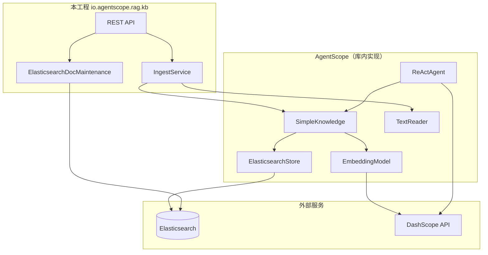
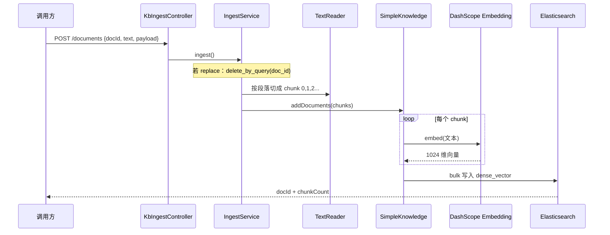
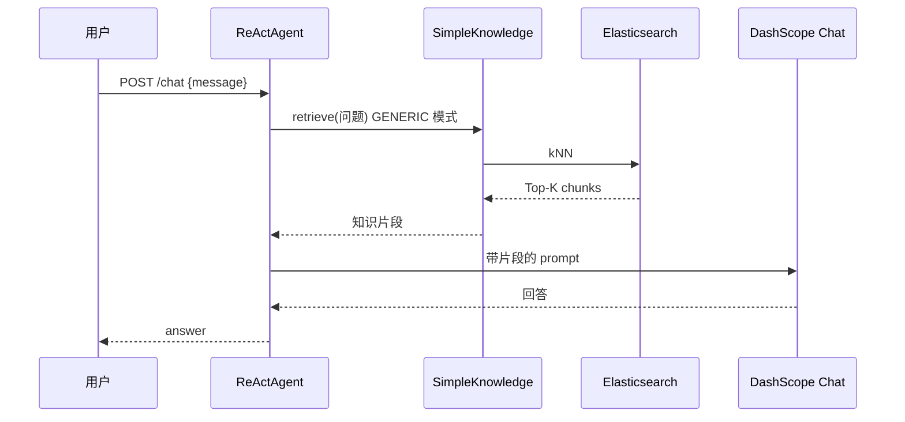

# SimpleKnowledge + Elasticsearch 知识库服务

把企业文档变成「可检索、可对话」的知识库：文本入库 → 向量写入 **Elasticsearch** → 用户提问时先检索再让大模型回答（RAG）。

| 项 | 值 |
|----|-----|
| 端口 | `8082` |
| 框架 | AgentScope Java `1.1.0-RC2` + Spring Boot 3.4 |
| 向量库 | `ElasticsearchStore`（默认） |
| ES 索引 | `agentscope_kb` |
| Embedding | DashScope `text-embedding-v3`，**1024 维** |

方案背景见 [README-vES.md](../README-vES.md)。代码仓库：https://github.com/qjli/agentscope-rag-es

---

## 一、用一句话理解本项目

**你们写 Spring API 管业务；AgentScope 管「切块 + 向量化 + 检索」；Elasticsearch 管「向量存哪儿」。**

```
用户 / 运营
    ↓ HTTP
本服务（03-simple-es-code）
    ↓ 调用
SimpleKnowledge（AgentScope）
    ↓ 读写
Elasticsearch（向量索引）
    ↓ 调用
DashScope（Embedding 把文字变向量，Chat 生成回答）
```

---

## 二、核心原理（分层说明）

### 2.1 三层分工



| 层级 | 谁 | 做什么 | 本仓库里的入口 |
|------|-----|--------|----------------|
| **业务层** | Spring Boot | 接 HTTP、校验参数、按 `doc_id` 删旧数据 | `Kb*Controller`、`IngestService` |
| **RAG 编排层** | `SimpleKnowledge` | 文本 → 向量 → 存入/查出 Store | `KnowledgeConfiguration` → `kbKnowledge` |
| **向量库层** | `ElasticsearchStore` | kNN 相似度检索、bulk 写入 | `StoreConfiguration` → `elasticsearchStore` |
| **运维补丁** | `ElasticsearchDocMaintenance` | 按 `doc_id` 批量删除（SDK 没封装） | `store/ElasticsearchDocMaintenance` |
| **对话层** | `ReActAgent` | 检索 + 生成回答（GENERIC/AGENTIC） | `ReActAgentConfiguration` |

**重要**：向量检索算法在 AgentScope 的 `ElasticsearchStore` 里，不在 `IngestService` 里。本工程**没有自研 ANN**，只选 Store 类型并补 ES 运维 API。

### 2.2 一条文档从进入到可检索



**三个 ID 别搞混**：

| 名称 | 含义 | 例子 |
|------|------|------|
| `doc_id` | 业务上的一篇文档 | `hr-leave-policy-v1`、`faq-001` |
| `chunk_id` | 一篇文档切成的第几段 | `0`、`1`、`2` |
| ES `_id` | 每个 chunk 在 ES 里的唯一键 | 由 AgentScope 根据内容自动生成 UUID |

更新同一篇文档：先按 `doc_id` **删掉 ES 里所有旧 chunk**，再重新切块、向量化、写入。

### 2.3 检索与对话

**纯检索** `POST /api/v1/kb/retrieve`：

1. 用户问题 → Embedding 成向量  
2. ES **kNN** 找最相似的几个 chunk  
3. 按 `scoreThreshold`（默认 0.35）过滤，返回文本 + 分数  

**RAG 对话** `POST /api/v1/kb/chat`：

1. `ReActAgent` 在 **GENERIC** 模式下，会在调大模型前**自动**先检索知识库  
2. 把检索到的片段塞进上下文，再让 `qwen-plus` 回答  
3. System Prompt 要求：无依据不编造  



### 2.4 ES 里一条记录长什么样

索引由 `ElasticsearchStore` 启动时自动创建（`dense_vector` + cosine）：

| 字段 | 作用 |
|------|------|
| `doc_id` | 逻辑文档 ID，删除/更新时用 |
| `chunk_id` | 块序号 |
| `content` | 原文（JSON 存的 TextBlock） |
| `vector` | 1024 维向量，检索用 |
| `payload` | 自定义元数据（来源、分类等） |

本阶段**只做向量检索（kNN）**，不做 BM25 全文检索。

---

## 三、项目结构（按职责看）

```
03-simple-es-code/
├── config/          # Bean 装配：ES Store、Embedding、Agent、分块参数
├── ingest/          # 入库核心：doc_id + 正文 → chunks → addDocuments
├── retrieve/        # 检索封装
├── chat/            # 对话封装
├── store/           # ES 运维：delete_by_query、_count、ping
├── faq/             # 可选：classpath FAQ → 走同一套 IngestService
├── web/             # REST + DTO
├── health/          # Actuator 健康检查
└── resources/
    ├── application.yml
    └── faq/faq-items.json
```

**FAQ 不是第二条链路**：`FaqBootstrapAdapter` 把每条 FAQ 转成 `docId=faq.id` 的文本，仍调用 `IngestService.ingest()`，和通用文档入库相同。

---

## 四、配置说明（看懂 yml 即可调参）

```yaml
agentscope:
  rag:
    simple:
      store-type: elasticsearch      # memory = 单测/无 ES
      embedding:
        dimensions: 1024             # 必须与 ES 索引、模型一致
      elasticsearch:
        url: http://localhost:9200
        index-name: agentscope_kb
      reader:
        chunk-size: 1024             # 切块大小
        chunk-overlap: 50            # 块之间重叠字数
      retrieve:
        limit: 5
        score-threshold: 0.35        # 相似度低于此的结果丢弃
  agent:
    rag-mode: GENERIC                # 或 AGENTIC（Agent 自己决定何时检索）
```

| 环境变量 | 作用 |
|----------|------|
| `DASHSCOPE_API_KEY` | Embedding + Chat（必填才能入库/对话） |
| `ES_URL` / `ES_INDEX` | Elasticsearch 地址与索引名 |
| `FAQ_BOOTSTRAP=true` | 启动时导入 `faq-items.json` |
| `RAG_STORE_TYPE=memory` | 不连 ES，仅内存（测试用） |

**Maven 依赖**：须使用 `elasticsearch-java` + `elasticsearch-rest5-client` **9.3.3**（`pom.xml` 已锁定）。Spring Boot 默认 8.15.x 会缺 `Rest5Client` 导致启动失败。

---

## 五、快速开始

### 前置

- JDK 17+
- Elasticsearch（本地示例 9.4.1）

```bash
docker run -d --name elasticsearch -p 9200:9200 \
  -e discovery.type=single-node \
  -e xpack.security.enabled=false \
  elasticsearch:9.4.1
```

### 启动

```bash
export DASHSCOPE_API_KEY=sk-your-key
export ES_URL=http://localhost:9200
# 可选：首次导入示例 FAQ
export FAQ_BOOTSTRAP=true

cd 03-simple-es-code
mvn clean spring-boot:run
```

- Swagger：http://localhost:8082/swagger-ui.html  
- 健康：http://localhost:8082/actuator/health  

### 典型操作

**1. 入库一篇制度**

```bash
curl -s -X POST http://localhost:8082/api/v1/kb/documents \
  -H 'Content-Type: application/json' \
  -d '{
    "docId": "hr-leave-policy-v1",
    "title": "年假制度",
    "text": "员工入职满一年可享受带薪年假。未休年假最多结转5天。",
    "payload": {"source": "wiki", "category": "HR"}
  }'
```

**2. 检索**

```bash
curl -s -X POST http://localhost:8082/api/v1/kb/retrieve \
  -H 'Content-Type: application/json' \
  -d '{"query": "年假可以结转吗", "limit": 3}'
```

**3. 对话**

```bash
curl -s -X POST http://localhost:8082/api/v1/kb/chat \
  -H 'Content-Type: application/json' \
  -d '{"message": "年假可以结转吗"}'
```

**4. 查看 ES 状态**

```bash
curl -s http://localhost:8082/api/v1/kb/status | jq .
```

---

## 六、API 一览

### `/api/v1/kb`（通用知识库）

| 方法 | 路径 | 说明 |
|------|------|------|
| POST | `/documents` | 新文档入库 |
| PUT | `/documents/{docId}` | 覆盖更新（先删后写） |
| DELETE | `/documents/{docId}` | 删除该 doc 全部 chunk |
| POST | `/retrieve` | 向量检索 |
| POST | `/chat` | RAG 对话 |
| GET | `/status` | ES 连通、索引名、文档数 |

### `/api/v1/faq`（兼容旧路径）

| 方法 | 路径 | 说明 |
|------|------|------|
| GET | `/status` | 同 KB 状态 |
| POST | `/reload` | 从 `faq-items.json` 重载进 ES |

---

## 七、常见问题

| 现象 | 原因 | 处理 |
|------|------|------|
| `Rest5Client` ClassNotFound | Spring Boot 拉了 ES 8.x 客户端 | `mvn clean` 后重编，确认依赖树为 9.3.3 |
| 检索/对话提示知识库为空 | ES 索引无数据 | 先 `POST /documents` 或 `POST /faq/reload` |
| 重启后数据还在 | 正常，向量在 ES 里 | 与 02 内存版不同 |
| 重复入库同一 `docId` 变多份 | 未走 PUT/先删 | 用 PUT 或 ingest 时 `replaceExisting=true` |
| Chat 不可用 | Agent 未配置 Key | 设置 `DASHSCOPE_API_KEY`，`agentscope.agent.enabled=true` |
| `num_candidates cannot exceed [10000]` | `limit` 过大（Store 里 `numCandidates=limit×2`） | `limit` 用 1～100，默认 5 即可 |

---

## 八、与 `02-simple-kg-code` 对比

| | 02（PoC） | 03（本工程） |
|--|-----------|--------------|
| 向量存哪 | 进程内存 `InMemoryStore` | Elasticsearch |
| 重启 | 索引丢失 | 数据保留 |
| 数据入口 |  mainly FAQ JSON | 任意文本 API + 可选 FAQ |
| 更新方式 | `clear()` 全表清空再加载 | 按 `doc_id` 删除再写入 |
| 多实例 | 各实例内存不一致 | 共享同一 ES 索引 |

---

## 九、参考

- [README-vES.md](../README-vES.md) — 方案、工业级差距、向量库落点  
- [03-es-ingest-sample](../03-es-ingest-sample/) — 无 Spring 的入库演示 main  
- [AgentScope RAG 文档](https://java.agentscope.io/zh/task/rag.html)  
- [ElasticsearchRAGExample](https://github.com/agentscope-ai/agentscope-java)（官方 ES 示例）  
