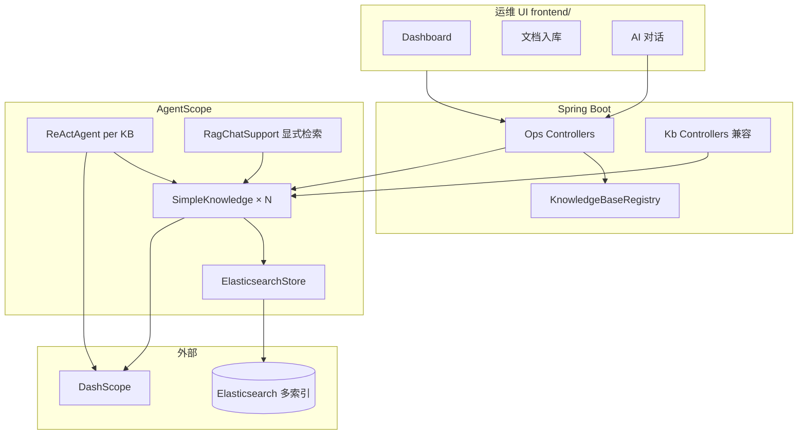
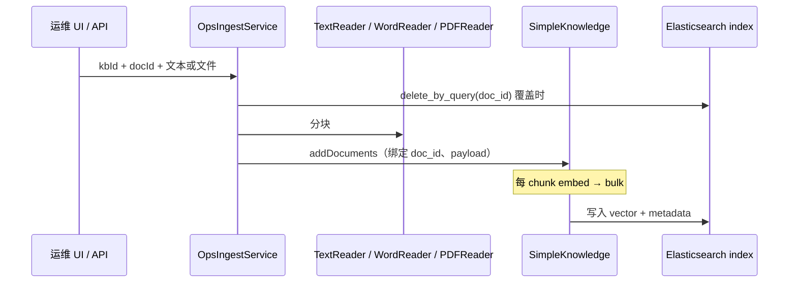
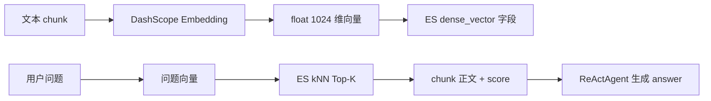

# SimpleKnowledge + Elasticsearch 知识库服务

把企业文档变成「可检索、可对话」的知识库：文本/文件入库 → 向量写入 **Elasticsearch** → 提问时先检索再让大模型回答（RAG）。附带 **运维 Web UI**（多知识库、Dashboard、文档管理、对话）。

| 项 | 值 |
|----|-----|
| 端口 | `8082` |
| 框架 | AgentScope Java `1.1.0-RC2` + Spring Boot 3.4 |
| 向量库 | `ElasticsearchStore`（默认） |
| 默认 ES 索引 | `agentscope_kb`（可配置；运维可增更多索引） |
| Embedding | DashScope `text-embedding-v3`，**1024 维** |
| 运维 UI | http://localhost:8082/ops/（`frontend/`） |
| 仓库 | https://github.com/qjli/agentscope-rag-es |

延伸阅读：[README-vES.md](../README-vES.md)（方案设计）· [README-optimize.md](./README-optimize.md)（入库优化）· [frontend/README.md](./frontend/README.md)（前端）· [向量与 ES 通俗解读](#向量与-es-向量库通俗解读)

---

## 目录

1. [一句话理解](#一句话理解)
2. [系统架构](#系统架构)
3. [核心原理](#核心原理)
4. [代码审视结论](#代码审视结论)
5. [项目结构](#项目结构)
6. [配置说明](#配置说明)
7. [快速开始](#快速开始)
8. [API 说明](#api-说明)
9. [运维 UI](#运维-ui)
10. [常见问题](#常见问题)
11. [与 02 对比](#与-02-simple-kg-code-对比)
12. [向量与 ES 向量库通俗解读](#向量与-es-向量库通俗解读)

---

## 一句话理解

**Spring 提供 REST 与多知识库运维；AgentScope 负责切块、Embedding、检索编排；Elasticsearch 存向量并用 kNN 检索；DashScope 负责 Embedding 与对话；React 运维台绑定 Ops API。**

本工程**不实现**向量索引算法，检索由 ES + `ElasticsearchStore` 完成。

---

## 系统架构



| 能力域 | 入口 | 说明 |
|--------|------|------|
| **运维（推荐）** | `/api/v1/ops/knowledge-bases/*` | 多知识库、文件入库、Dashboard、分开展示检索/回答的对话 |
| **兼容 API** | `/api/v1/kb/*` | 单默认索引 `agentscope_kb`，文本入库/检索/对话 |
| **FAQ 兼容** | `/api/v1/faq/*` | 启动加载或 reload → 写入**默认**知识库 |

---

## 核心原理

### 分层职责

| 层级 | 组件 | 职责 |
|------|------|------|
| 接入层 | `web/*`、`ops/web/*` | REST、`@Valid`、Swagger、CORS |
| 多库注册 | `KnowledgeBaseRegistry` | `kbId` ↔ ES `index-name`，持久化 `data/knowledge-bases.json` |
| 运维入库 | `OpsIngestService` | Text / Word / PDF 分块 → `addDocuments` |
| 兼容入库 | `IngestService` | 默认库文本入库 |
| 显式检索 | `RagChatSupport` | 对话前 `knowledge.retrieve`，结果写入 `ChatResponse` |
| 对话 | `OpsChatService` / `KbChatService` | 每库独立 `ReActAgent`（Ops）或单 Agent（Kb） |
| ES 运维 | `ElasticsearchDocMaintenance` | 按索引 `delete_by_query`、`_count`、文档聚合 |
| 向量库 | `ElasticsearchStore` | bulk + kNN（`numCandidates=max(limit×2,50)`） |

### 入库链路（Ops）



**物料类型**（`MaterialType`）：

| 类型 | Reader | 文件 |
|------|--------|------|
| `TEXT` | `TextReader` | 请求体 `text` 或纯文本文件 |
| `WORD` | `WordReader` | `.docx` |
| `PDF` | AgentScope `PDFReader` | `.pdf` |

### 对话链路（检索与回答分离）

1. `RagChatSupport.retrieveForChat`：用 `agentscope.agent.retrieve` 配置检索，得到 `retrievedDocuments`
2. `ReActAgent.call`（GENERIC）：内部再次检索并生成 `answer`
3. 响应同时返回 **`retrievedDocuments`**（可核对 RAG 依据）与 **`answer`**（模型生成）

运维 UI 中「检索命中」默认**收起**，「模型回答」单独展示。

### 三个 ID

| 字段 | 含义 |
|------|------|
| `doc_id` | 业务文档 ID，更新/删除粒度 |
| `chunk_id` | 分块序号 `0,1,2…` |
| ES `_id` | chunk 级（AgentScope 生成） |

### 检索（kNN + 阈值）

- `limit` 业务 API 上限 **100**（防 ES `num_candidates` 超限）
- 默认 `scoreThreshold`：检索 API `0.35`；对话 Agent `0.35`（`agentscope.agent.retrieve`）

---

## 代码审视结论

> 基于当前实现（含运维 UI、多知识库），供维护参考。

### 已做对的部分

| 点 | 说明 |
|----|------|
| 向量库可切换 | `StoreConfiguration`：`elasticsearch` / `memory`（单测） |
| 多知识库 | 每库独立 `ElasticsearchStore` + `SimpleKnowledge`；默认库复用 Spring Bean |
| 注册表持久化 | `OpsDataPaths` 绝对路径；**仅创建库时写盘**，启动不覆盖文件 |
| 统一切块配置 | `KnowledgeConfiguration` 注入 Text / Word / PDF Reader |
| 对话可观测 | `ChatResponse` 含 `query`、`retrievedDocuments`、`answer` |
| 按 doc 更新 | 覆盖入库先 `delete_by_query(doc_id)` |
| ES 客户端版本 | `pom.xml` 锁定 **9.3.3 + rest5-client** |
| 前端切换库 | `<Outlet key={selectedKbId} />` 刷新 Dashboard/文档/对话 |
| 检索 limit 防护 | `KbRetrieveService` 上限 100 |

### 当前局限

| 点 | 影响 |
|----|------|
| 同步阻塞 | `addDocuments().block()`、`.block()` 对话，大文件占用 HTTP 线程 |
| 无鉴权 | 生产需网关或 Spring Security |
| 无混合检索 / Rerank | 仅 kNN |
| 双 ES 连接 | SDK Store + `ElasticsearchDocMaintenance`（HttpClient）各一条 |
| GENERIC 双次检索 | API 显式检索 + Agent 内 Hook 检索，配置相同但调用两次 |
| `memory` 模式 | 仅支持默认知识库，不支持多库与按 doc 删除 |
| 会话 | `InMemoryMemory`，无 `sessionId` 持久化 |

### 安全提醒

- **勿将真实 Key 提交 Git**；使用 `export DASHSCOPE_API_KEY=...`
- `application.yml` 仅为占位符 `sk-your-dashscope-api-key`

---

## 项目结构

```
03-simple-es-code/
├── frontend/                    # React + Vite + Tailwind 运维 UI
│   └── src/
│       ├── pages/               # Dashboard、Documents、Chat
│       ├── context/KbContext.tsx
│       └── api/client.ts
├── data/                        # 运行时（gitignore）
│   ├── knowledge-bases.json     # 知识库注册表
│   └── uploads/                 # 临时上传
└── src/main/java/io/agentscope/rag/kb/
    ├── config/                  # Store、Knowledge、Agent、OpsDataPaths、CORS
    ├── ops/
    │   ├── KnowledgeBaseRegistry.java
    │   ├── OpsIngestService / OpsDashboardService / OpsChatService
    │   └── web/                 # Ops REST
    ├── ingest/IngestService.java
    ├── chat/RagChatSupport.java
    ├── retrieve/KbRetrieveService.java
    ├── store/ElasticsearchDocMaintenance.java
    ├── faq/                      # 可选 FAQ 引导
    └── web/                      # 兼容 Kb REST
```

---

## 配置说明

```yaml
agentscope:
  rag:
    simple:
      store-type: elasticsearch
      elasticsearch:
        url: http://localhost:9200
        index-name: agentscope_kb    # 默认库索引
      reader:
        chunk-size: 1024
        chunk-overlap: 50
      retrieve:                      # POST /kb/retrieve
        limit: 5
        score-threshold: 0.35
    ops:
      data-dir: ./data
      registry-file: ./data/knowledge-bases.json
  agent:
    enabled: true
    dashscope-api-key: ${DASHSCOPE_API_KEY}
    rag-mode: GENERIC
    retrieve:                        # 对话检索 + RagChatSupport
      limit: 3
      score-threshold: 0.35
```

| 环境变量 | 说明 |
|----------|------|
| `DASHSCOPE_API_KEY` | Embedding + Chat（必填） |
| `ES_URL` / `ES_INDEX` | 默认库 ES |
| `RAG_STORE_TYPE=memory` | `mvn test`，无 ES |
| `RAG_OPS_REGISTRY_FILE` | 知识库注册表绝对路径（推荐生产固定） |
| `FAQ_BOOTSTRAP=true` | 启动导入 FAQ 到**默认库** |

---

## 快速开始

### 1. Elasticsearch

```bash
docker run -d --name elasticsearch -p 9200:9200 \
  -e discovery.type=single-node \
  -e xpack.security.enabled=false \
  elasticsearch:9.4.1
```

### 2. 后端

```bash
export DASHSCOPE_API_KEY=sk-your-key
export ES_URL=http://localhost:9200

cd 03-simple-es-code
mvn clean spring-boot:run
```

| 入口 | URL |
|------|-----|
| **运维 UI** | http://localhost:8082/ops/ |
| Swagger | http://localhost:8082/swagger-ui.html |
| Actuator | http://localhost:8082/actuator/health |

### 3. 前端（可选）

```bash
cd frontend && npm install && npm run build   # 生产：由 Spring 托管 /ops/
# 或开发：npm run dev → http://localhost:5173/ops/
```

### 4. 验证（Ops API）

```bash
# 新建知识库
curl -s -X POST http://localhost:8082/api/v1/ops/knowledge-bases \
  -H 'Content-Type: application/json' \
  -d '{"id":"hr-kb","indexName":"hr_dismiss","displayName":"HR制度"}'

# 文本入库（写入 hr_dismiss 索引，非默认库）
curl -s -X POST http://localhost:8082/api/v1/ops/knowledge-bases/hr-kb/documents \
  -H 'Content-Type: application/json' \
  -d '{"docId":"demo-1","title":"年假","text":"年假最多结转5天。"}'

# 对话（返回检索 + 回答）
curl -s -X POST http://localhost:8082/api/v1/ops/knowledge-bases/hr-kb/chat \
  -H 'Content-Type: application/json' \
  -d '{"message":"年假可以结转吗"}'
```

### 5. 测试

```bash
mvn test
```

---

## API 说明

### `/api/v1/ops/knowledge-bases`（运维，推荐）

| 方法 | 路径 | 说明 |
|------|------|------|
| GET | `/` | 知识库列表（含 chunk/doc 统计） |
| POST | `/` | 创建知识库（`id` + `indexName`） |
| GET | `/{kbId}/dashboard` | Dashboard 指标、物料分布 |
| GET | `/{kbId}/documents` | 按 `doc_id` 聚合的文档列表 |
| POST | `/{kbId}/documents` | 文本入库（JSON） |
| POST | `/{kbId}/documents/upload` | 文件入库（`materialType=TEXT\|WORD\|PDF`） |
| PUT | `/{kbId}/documents/{docId}` | 文本覆盖 |
| PUT | `/{kbId}/documents/{docId}/upload` | 文件覆盖 |
| DELETE | `/{kbId}/documents/{docId}` | 按 `doc_id` 删全部 chunk |
| POST | `/{kbId}/chat` | RAG 对话 |

**创建知识库**：

```json
{
  "id": "hr-kb",
  "indexName": "hr_dismiss",
  "displayName": "HR 制度库",
  "description": "可选"
}
```

**对话响应**（检索与 LLM 分离）：

```json
{
  "query": "年假可以结转吗",
  "retrievedDocuments": [
    {
      "docId": "demo-1",
      "chunkId": "0",
      "score": 0.82,
      "content": "年假最多结转5天……"
    }
  ],
  "answer": "根据制度……",
  "knowledgeBaseId": "hr-kb",
  "indexName": "hr_dismiss"
}
```

### `/api/v1/kb`（兼容，仅默认库）

| 方法 | 路径 | 说明 |
|------|------|------|
| POST | `/documents` | 文本入库 → `agentscope_kb` |
| PUT | `/documents/{docId}` | 覆盖 |
| DELETE | `/documents/{docId}` | 删除 |
| POST | `/retrieve` | 检索，`limit` 1～100 |
| POST | `/chat` | 对话（含 `retrievedDocuments`） |
| GET | `/status` | 默认库状态 |

### `/api/v1/faq`

| 方法 | 路径 | 说明 |
|------|------|------|
| POST | `/reload` | 重载 FAQ → **默认**索引 |

---

## 运维 UI

| 页面 | 功能 |
|------|------|
| **Dashboard** | chunk 总数、doc 数、入库规模柱状图、物料饼图 |
| **文档** | 选物料类型入库/覆盖；列表删除 |
| **AI 对话** | 选知识库；检索命中（默认收起）+ 模型回答分栏 |

**交互**：头部切换知识库时，子页面通过 `key={selectedKbId}` **整页刷新**，避免串库。

**注意**：向 `hr-kb` 对话前，须向**同一知识库**入库；`POST /api/v1/kb/documents` 只写默认索引。

---

## 常见问题

| 现象 | 原因 | 处理 |
|------|------|------|
| 重启后新建库消失 | 注册表路径随 `user.dir` 变化或被启动写盘覆盖 | 已修复：绝对路径 + 启动只读；固定 `RAG_OPS_REGISTRY_FILE` |
| Ops 对话报知识库为空 | 数据在默认索引，未向该 `kbId` 入库 | 在 UI「文档」页选中对应库再入库 |
| `Rest5Client` 找不到 | ES 8.x | 依赖 9.3.3，见 `pom.xml` |
| `num_candidates` 超限 | `limit` 过大 | API 限制 ≤100 |
| Chat 无检索块 | 低于 `scoreThreshold` | 调低阈值或改写入内容 |
| 切换库页面仍是旧数据 | 前端未刷新 | 已用 `Outlet key`；重新 `npm run build` |
| ES 有数据但库列表为空 | 只建了 ES 索引未注册 | UI 新建同 `indexName` 的知识库 |

---

## 与 `02-simple-kg-code` 对比

| 维度 | 02 PoC | 03 本工程 |
|------|--------|-----------|
| 向量存储 | `InMemoryStore` | `ElasticsearchStore` |
| 多索引 / 多库 | 否 | `KnowledgeBaseRegistry` |
| 运维 UI | 否 | `frontend/` + Ops API |
| 文件入库 | 否 | Word / PDF |
| 对话响应 | 仅 answer | 检索块 + answer |
| 文档更新 | 全量 clear | 按 `doc_id` 删后写 |

---

## 向量与 ES 向量库通俗解读

> 本章面向 **不熟悉 Elasticsearch** 的读者，说明本项目中「向量」是什么、ES 如何承担向量库、RAG 为何需要它，以及和专业向量数据库的差距。  
> 主文来自通俗解读（会话 `462e068f-22ee-42d5-96d4-2ff5479564f6`）；代码落点与差距表来自技术审视（会话 `4a0d435f-eaf9-4f54-bb22-b4b39707f88b`），作为补充，不重复删减主文要点。

### 先澄清：本项目的「向量库」是什么

本工程**没有单独再装一套 Milvus / Qdrant**，而是把 **Elasticsearch 当作向量库** 使用：

- AgentScope 的 `ElasticsearchStore`（类注释即 *Elasticsearch vector database store*）
- ES 索引里建立 **`dense_vector` 字段**，并用 **kNN 检索**（近似最近邻，底层常用 HNSW 图索引）

业务 Spring 代码里**几乎不出现「自研 ANN 算法」**；向量如何存、如何搜，都在 **AgentScope Store + ES** 这一层完成。



---

### 一、生活比喻：带智能索引的图书馆

| 现实世界 | 本项目里 |
|----------|----------|
| 一本书拆成很多 **段落卡片** | 文档切成很多 **chunk（分块）** |
| 每张卡片按「意思相近」归类 | 每段文字变成一串 **数字（向量）**，意思相近的数字也相近 |
| 读者问「年假怎么算？」 | 用户提问 |
| 找出 **意思最相关的几张卡片** | **向量检索**：找 Top-K 最相似 chunk |
| 把卡片交给专家解答 | **大模型**根据检索内容生成回答 |

**向量**：这段文字在机器眼里的「语义坐标」——不是汉字，而是 **1024 个浮点数**（DashScope `text-embedding-v3`）。

**向量库**：存这些数字、并能快速找出「和问题最像的几段」的系统；在本项目中由 **Elasticsearch 的 vector 字段 + kNN** 承担。

---

### 二、「向量」在本项目里到底是什么

#### 2.1 两种数据，不要混在一起

每个 chunk 入库后有两层信息：

```
┌─────────────────────────────────────────┐
│  chunk（一条知识片段）                    │
├─────────────────────────────────────────┤
│  ① 给人看的：正文、标题、doc_id、来源文件   │  ← 对话、文档列表里看到的
│  ② 给机器算的：1024 维向量（一串浮点数）   │  ← 存在 ES 的 vector 字段，UI 不展示
└─────────────────────────────────────────┘
```

- **正文**：「年假最多结转 5 天……」——人和 LLM 阅读的内容。
- **向量**：如 `[0.12, -0.03, 0.87, …]` 共 1024 个数——**只用于判断「像不像」**。

#### 2.2 向量从哪来、干什么用

1. **入库**：每段正文 → DashScope **Embedding** → 1024 维向量 → 与正文一并写入 ES。
2. **提问**：问题 → 同样变成向量 → 在 ES 中找 **最接近** 的若干 chunk → 取出正文 → 交给大模型。

**向量是语义相似度的计算中间结果**；业务上的 `doc_id`、chunk 正文不是向量本身。

#### 2.3 前端能看到什么、看不到什么

| 运维 UI 里看到的 | 与向量的关系 |
|------------------|--------------|
| Dashboard「Chunk 总数」 | 每条 chunk 在 ES 中通常 **对应一条向量记录** |
| 头部 `indexName` | 当前 **存向量的 ES 索引**（一个知识库 ≈ 一个索引） |
| 对话「检索命中」正文 + **score** | score 为 **相似度分数**（向量检索算出）；展示正文而非 1024 个数 |
| 文档列表 doc_id、chunk 数 | 业务 ID；chunk 数 ≈ 向量条数 |

本项目 **全程使用向量做检索**，UI **只展示「搜到了哪几段、有多像」**，不展示原始向量数组。

---

### 三、RAG 为什么需要「向量库」

**RAG** = 先 **Retrieval（检索）** 知识库，再 **Augmented Generation（增强生成）**。

典型场景：文档写「剩余假期可延续至次年 3 月」，用户问「年假能结转吗？」——**关键词搜索**可能失败，**向量检索**看 **意思是否接近**，更容易命中。

因此需要：

1. 事先把知识变成向量存起来（**写向量库**）
2. 提问时再算问题向量，快速找最像的几段（**查向量库**）
3. 只把这几段正文给 LLM，而不是整库塞入上下文

没有第 1、2 步，就没有可靠的 **语义检索**，RAG 会退化为「瞎猜」或「全库硬塞」。

| 方式 | 局限 | 本项目 |
|------|------|--------|
| 关键词 / BM25 | 问法与原文措辞不同时易漏召 | **未做** ES 文本混合检索 |
| 全量塞给 LLM | 超长、贵、超上下文 | 不可行 |
| **向量语义检索** | 用相似度 Top-K 取相关 chunk | **当前方案** |

---

### 四、Elasticsearch 在本项目中的角色与技术原理

#### 4.1 ES 是什么（一句话）

**Elasticsearch** 原是 **搜索 / 日志 / 全文检索** 引擎；近年增加 **`dense_vector`（稠密向量）** 与 **kNN 检索**，因此 **也能当向量库用**。

在本项目中：**ES = 持久化存储 + 向量相似度搜索**；Spring 业务代码 **不自己算** 向量距离。

#### 4.2 ES 里实际存了什么

每个知识库对应 ES 的一个 **索引（index）**，如 `agentscope_kb`、`hr_dismiss`。索引内每条文档 ≈ **一个 chunk + 一条向量**：

| 字段（简化） | 含义 |
|--------------|------|
| `vector` | **1024 维向量**（核心） |
| `content` | chunk 正文 |
| `doc_id` | 业务文档 ID（更新/删除粒度） |
| `chunk_id` | 分块序号 0,1,2… |
| `payload` | 标题、物料类型、入库时间等 JSON |

**索引（index）** ≈ 一个知识库的「向量表」；Dashboard 上的 **Chunk 总数** ≈ 该索引内向量条数。

AgentScope `ElasticsearchStore` 建索引时：`dense_vector`，**dims=1024**，**cosine** 相似度，`index=true`（可 kNN）。

#### 4.3 ES 如何「找相似」（kNN，通俗版）

在 1024 维空间中，问题和每个 chunk 都是一个点；ES 用 **近似最近邻（ANN）** 算法（如 **HNSW**），**不必与每个点精确比距**，即可较快找出离问题最近的 **K** 个点。

本项目通过 `ElasticsearchStore` 发起 kNN，并设置：

- **Top-K（limit）**：最多返回几条（对话默认 3，检索 API 默认 5，上限 100）
- **scoreThreshold**：相似度过低的结果丢弃（默认 0.35）
- **numCandidates**：内部候选数 `max(limit×2, 50)`（过大可能触发 ES 上限报错）

#### 4.4 本工程与 ES 的两条连接

```
入库 / 检索（向量读写）    AgentScope ElasticsearchStore  →  ES 官方 SDK
删文档、统计、Dashboard     ElasticsearchDocMaintenance     →  ES HTTP REST
```

均连接 **同一 ES、同一索引**；按 `doc_id` 删除、聚合列表等运维能力由 REST 层补充（AgentScope Store 未提供 `deleteByDocId`）。

---

### 五、从入库到对话：全流程（零基础版）

```
【入库】
  用户上传/粘贴文档
    → TextReader / WordReader / PDFReader 切成 chunk
    → 每段正文 → DashScope → 1024 维向量
    → 正文 + 向量 + doc_id 等 → 写入 ES 对应索引

【提问】
  用户输入问题
    → 问题向量化
    → ES 在 vector 字段 kNN 找最相似 chunk
    → 「检索命中」列表（正文 + score）
    → ReActAgent（大模型）生成「模型回答」

【运维 UI】
  Dashboard：索引内 chunk（≈ 向量）总数
  文档页：按 doc_id 管理；删除 doc = 删除其下全部 chunk/向量行
  对话页：检索命中（默认收起）+ 模型回答分栏
```

**多知识库**：每个库绑定独立 **index-name**，向量 **物理分开存储**，互不混用。向 `hr-kb` 对话前，须向 **同一知识库** 入库；`POST /api/v1/kb/documents` 仅写入 **默认** 索引 `agentscope_kb`。

---

### 六、【补充】代码里向量与向量库出现在哪里

> 以下为技术审视摘要，便于开发对照源码。

#### 6.1 后端：配置与 Bean（向量库接入点）

| 位置 | 体现的概念 |
|------|------------|
| `StoreConfiguration` | 创建 `ElasticsearchStore` / `InMemoryStore`，传入 **dimensions: 1024** |
| `KnowledgeConfiguration` | `EmbeddingModel` + `SimpleKnowledge(embeddingStore=kbVectorStore)` |
| `SimpleRagProperties` | `embedding.dimensions`、`elasticsearch.index-name` |
| `KnowledgeBaseRegistry` | 每知识库一个 **`ElasticsearchStore(indexName=…)`** |

本工程 **只装配** 向量库，**不实现** 索引算法。

#### 6.2 后端：入库 = 写向量

`OpsIngestService` / `IngestService` → `knowledge.addDocuments(chunks)`：

1. Reader 产出 chunk（文本）
2. `SimpleKnowledge` 内 **`embeddingModel.embed()`** 逐 chunk
3. **`embeddingStore.add()`** → `ElasticsearchStore` bulk；文档须带 embedding

向量落盘于 `ElasticsearchStore`：字段 **`vector`**，`dense_vector`，**cosine**，dims=1024。

#### 6.3 后端：检索 = 向量相似度搜索

| 调用链 | 作用 |
|--------|------|
| `KbRetrieveService.retrieve` | `kbKnowledge.retrieve(query, config)` |
| `RagChatSupport.retrieveForChat` | 对话前显式检索，返回带 **score** 的 chunk |
| `SimpleKnowledge.retrieve` | 问题 embed → **`embeddingStore.search(queryEmbedding, …)`** |

`ElasticsearchStore.executeSearch`：`field("vector").knn(...).numCandidates(max(limit×2,50))`，`minScore(scoreThreshold)`。

#### 6.4 后端：运维层

`ElasticsearchDocMaintenance`：`/_count`、按 `doc_id` 的 `delete_by_query`、文档聚合——操作 **存向量的 ES 索引**，不参与 kNN 实现。

#### 6.5 前端

不展示 1024 维数组；展示 chunk 数、**indexName**、检索 **score** 与正文——即 **RAG 语义检索结果**，非向量数学对象。

#### 6.6 读代码对照表

| 关心的概念 | 代码里对应什么 |
|------------|----------------|
| 向量 | `double[1024]`，由 `DashScopeTextEmbedding.embed()` 产生 |
| 向量库 | `VDBStoreBase` → 本项目 **`ElasticsearchStore`** |
| 向量表/集合 | ES **index**（如 `agentscope_kb`） |
| 向量行 | 每个 **chunk** 一条，`vector` 字段 |
| 向量检索 | `SimpleKnowledge.retrieve` → ES **kNN** |
| 相似度 | `Document.score` → UI「检索命中」 |
| 向量库运维 UI | Dashboard chunk 数、按 index 切换知识库 |

---

### 七、ES 是「专业的向量数据库」吗？

#### 7.1 直接结论

| 说法 | 是否准确 |
|------|----------|
| ES **能当向量库用** | ✅ 准确（本项目即如此） |
| ES **等于** Milvus / Qdrant / Pinecone 等专用向量库 | ❌ 不准确 |
| ES 是 **带向量能力的通用搜索引擎** | ✅ 更准确 |

> **ES 在本项目是「兼做向量检索的文档/搜索引擎」**；**Milvus、Qdrant 等是「为向量检索而生的专用数据库」**。

#### 7.2 与专业向量库的能力差距

| 维度 | 本项目（ES） | 专业向量库（典型） |
|------|--------------|-------------------|
| **主场景** | 日志/全文 + 顺带 kNN | 大规模、低延迟、高 QPS 向量检索 |
| **索引** | ES `dense_vector` + HNSW | HNSW、IVF、DiskANN、量化等多种索引 |
| **混合检索** | 当前 **仅 kNN**，未 BM25+向量融合 | 原生 hybrid、learned sparse 等 |
| **Rerank** | 无，仅 `scoreThreshold` | 常配合 cross-encoder 精排 |
| **规模** | 万～百万 chunk 较合适 | 十亿级向量、独立扩缩容 |
| **过滤** | payload 在 JSON，过滤能力有限 | 强 metadata filter、分区、多租户 |
| **Embedding 版本** | 维度绑死 1024，换模型常需重建索引 | 多 collection、迁移工具更成熟 |
| **团队已有 ES** | 少一套组件，上手快 | 需额外运维专用向量系统 |

AgentScope 可换 `MilvusStore`、`QdrantStore` 等（改 `StoreConfiguration`）；**`SimpleKnowledge` 编排可保留**，业务 `doc_id` 与 Ops UI 大部分可延续。

#### 7.3 本项目在向量能力上「刻意简单」之处

与是否选用 ES 无关，属 **当前 RAG 方案选型**：

- 仅 **语义向量检索**，无关键词混合
- 无 **Rerank**
- 每 chunk **一条向量**；换 Embedding 须 **删索引重建**
- 入库 **每 chunk 一次 embed API**（成本见 [README-optimize.md](./README-optimize.md)）
- **GENERIC** 对话：API 显式检索 + Agent 内 Hook 检索，配置相同但 **调用两次**
- ES **双连接**：SDK（向量读写）+ HttpClient（运维 REST）

#### 7.4 何时 ES 够用 vs 何时考虑专业向量库

**ES 够用（PoC / 中小知识库）**：

- 向量量级：万～百万 chunk
- 以文本 RAG 为主，团队已有 ES
- 可接受 kNN + 阈值，暂不追求 SOTA 召回

**应考虑专业向量库**：

- 千万～亿级向量、检索 P99 要求严
- 需要 **hybrid + rerank + 复杂 metadata 过滤**
- 多租户、多 embedding 版本并存
- 向量检索是 **核心产品能力**，而非 ES 附加功能

---

### 八、小词典（给非 ES 同事）

| 词 | 通俗解释 |
|----|----------|
| **Embedding / 向量化** | 把一段话变成固定长度数字串，便于比「意思像不像」 |
| **1024 维** | 该数字串有 1024 个分量；由模型决定 |
| **chunk** | 文档切出的一小段；检索与入库的最小单位 |
| **向量库** | 存向量并能「找最像 K 条」的系统；本项目 = ES 某索引的 `vector` 字段 |
| **ES 索引（index）** | 类似表名/库名；一个知识库对应一个 index |
| **kNN** | 找与问题 **最相近的 K 条** 向量及对应正文 |
| **score** | 相似度分数；对话「检索命中」中的数值，越高通常越相关 |
| **dense_vector** | ES 专存向量的字段类型 |
| **SimpleKnowledge** | AgentScope：embed → 写 Store → 检索时 embed + search |
| **ElasticsearchStore** | AgentScope 对接 ES 的向量读写；**向量库逻辑在此，不在 Controller** |
| **ANN** | 近似最近邻；不必遍历全部向量，用 HNSW 等结构加速 |

---

### 九、三句话总结

1. **向量** = 每段知识的「语义坐标」（1024 个数字）；**正文**才是人和 LLM 读的内容。  
2. **本项目的向量库** = Elasticsearch 各知识库索引中的 **`vector` 字段 + kNN 检索**；Spring/前端管 `doc_id` 与 UI，**不算向量、不建 ANN 索引**。  
3. **ES 不是专用向量数据库**，而是 **能存能搜向量的搜索引擎**；对本知识库场景够用；与 Milvus/Qdrant 的差距在 **规模、混合检索、精排与向量专项运维**，而非「能不能做 RAG」。

---

## 参考

- [README-vES.md](../README-vES.md)
- [README-optimize.md](./README-optimize.md)
- [03-es-ingest-sample](../03-es-ingest-sample/)
- [AgentScope RAG](https://java.agentscope.io/zh/task/rag.html)
