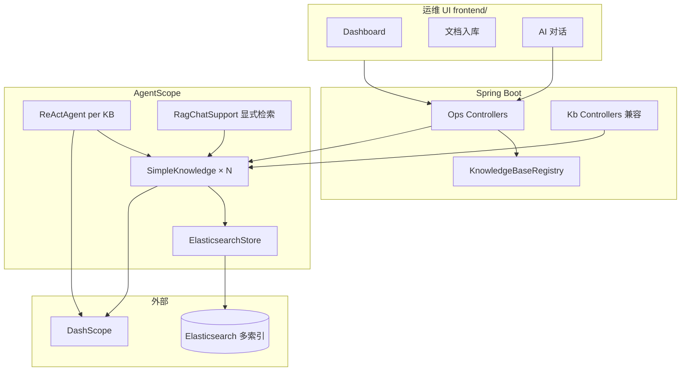
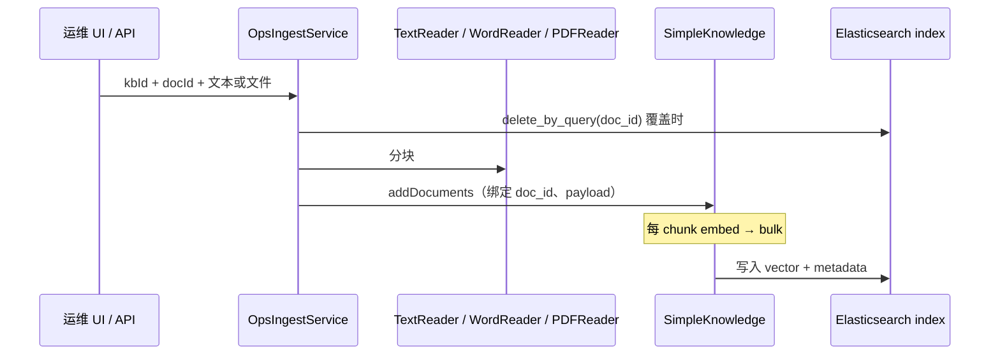

# SimpleKnowledge + Elasticsearch 知识库服务

把企业文档变成「可检索、可对话」的知识库：文本/文件入库 → 向量写入 **Elasticsearch** → 提问时先检索再让大模型回答（RAG）。附带 **运维 Web UI**（多知识库、Dashboard、文档管理、对话）。

| 项 | 值 |
|----|-----|
| 端口 | `8082` |
| 框架 | AgentScope Java `1.1.0-RC2` + Spring Boot 3.4 |
| 向量库 | `ElasticsearchStore`（默认） |
| 默认 ES 索引 | `agentscope_kb`（可配置；运维可增更多索引） |
| Embedding | DashScope `text-embedding-v3`，**1024 维** |
| 运维 UI | http://localhost:8082/ops/（`frontend/`） |
| 仓库 | https://github.com/qjli/agentscope-rag-es |

延伸阅读：[README-vES.md](../README-vES.md)（方案设计）· [README-optimize.md](./README-optimize.md)（入库优化）· [frontend/README.md](./frontend/README.md)（前端）

---

## 目录

1. [一句话理解](#一句话理解)
2. [系统架构](#系统架构)
3. [核心原理](#核心原理)
4. [代码审视结论](#代码审视结论)
5. [项目结构](#项目结构)
6. [配置说明](#配置说明)
7. [快速开始](#快速开始)
8. [API 说明](#api-说明)
9. [运维 UI](#运维-ui)
10. [常见问题](#常见问题)
11. [与 02 对比](#与-02-simple-kg-code-对比)

---

## 一句话理解

**Spring 提供 REST 与多知识库运维；AgentScope 负责切块、Embedding、检索编排；Elasticsearch 存向量并用 kNN 检索；DashScope 负责 Embedding 与对话；React 运维台绑定 Ops API。**

本工程**不实现**向量索引算法，检索由 ES + `ElasticsearchStore` 完成。

---

## 系统架构



| 能力域 | 入口 | 说明 |
|--------|------|------|
| **运维（推荐）** | `/api/v1/ops/knowledge-bases/*` | 多知识库、文件入库、Dashboard、分开展示检索/回答的对话 |
| **兼容 API** | `/api/v1/kb/*` | 单默认索引 `agentscope_kb`，文本入库/检索/对话 |
| **FAQ 兼容** | `/api/v1/faq/*` | 启动加载或 reload → 写入**默认**知识库 |

---

## 核心原理

### 分层职责

| 层级 | 组件 | 职责 |
|------|------|------|
| 接入层 | `web/*`、`ops/web/*` | REST、`@Valid`、Swagger、CORS |
| 多库注册 | `KnowledgeBaseRegistry` | `kbId` ↔ ES `index-name`，持久化 `data/knowledge-bases.json` |
| 运维入库 | `OpsIngestService` | Text / Word / PDF 分块 → `addDocuments` |
| 兼容入库 | `IngestService` | 默认库文本入库 |
| 显式检索 | `RagChatSupport` | 对话前 `knowledge.retrieve`，结果写入 `ChatResponse` |
| 对话 | `OpsChatService` / `KbChatService` | 每库独立 `ReActAgent`（Ops）或单 Agent（Kb） |
| ES 运维 | `ElasticsearchDocMaintenance` | 按索引 `delete_by_query`、`_count`、文档聚合 |
| 向量库 | `ElasticsearchStore` | bulk + kNN（`numCandidates=max(limit×2,50)`） |

### 入库链路（Ops）



**物料类型**（`MaterialType`）：

| 类型 | Reader | 文件 |
|------|--------|------|
| `TEXT` | `TextReader` | 请求体 `text` 或纯文本文件 |
| `WORD` | `WordReader` | `.docx` |
| `PDF` | AgentScope `PDFReader` | `.pdf` |

### 对话链路（检索与回答分离）

1. `RagChatSupport.retrieveForChat`：用 `agentscope.agent.retrieve` 配置检索，得到 `retrievedDocuments`
2. `ReActAgent.call`（GENERIC）：内部再次检索并生成 `answer`
3. 响应同时返回 **`retrievedDocuments`**（可核对 RAG 依据）与 **`answer`**（模型生成）

运维 UI 中「检索命中」默认**收起**，「模型回答」单独展示。

### 三个 ID

| 字段 | 含义 |
|------|------|
| `doc_id` | 业务文档 ID，更新/删除粒度 |
| `chunk_id` | 分块序号 `0,1,2…` |
| ES `_id` | chunk 级（AgentScope 生成） |

### 检索（kNN + 阈值）

- `limit` 业务 API 上限 **100**（防 ES `num_candidates` 超限）
- 默认 `scoreThreshold`：检索 API `0.35`；对话 Agent `0.35`（`agentscope.agent.retrieve`）

---

## 代码审视结论

> 基于当前实现（含运维 UI、多知识库），供维护参考。

### 已做对的部分

| 点 | 说明 |
|----|------|
| 向量库可切换 | `StoreConfiguration`：`elasticsearch` / `memory`（单测） |
| 多知识库 | 每库独立 `ElasticsearchStore` + `SimpleKnowledge`；默认库复用 Spring Bean |
| 注册表持久化 | `OpsDataPaths` 绝对路径；**仅创建库时写盘**，启动不覆盖文件 |
| 统一切块配置 | `KnowledgeConfiguration` 注入 Text / Word / PDF Reader |
| 对话可观测 | `ChatResponse` 含 `query`、`retrievedDocuments`、`answer` |
| 按 doc 更新 | 覆盖入库先 `delete_by_query(doc_id)` |
| ES 客户端版本 | `pom.xml` 锁定 **9.3.3 + rest5-client** |
| 前端切换库 | `<Outlet key={selectedKbId} />` 刷新 Dashboard/文档/对话 |
| 检索 limit 防护 | `KbRetrieveService` 上限 100 |

### 当前局限

| 点 | 影响 |
|----|------|
| 同步阻塞 | `addDocuments().block()`、`.block()` 对话，大文件占用 HTTP 线程 |
| 无鉴权 | 生产需网关或 Spring Security |
| 无混合检索 / Rerank | 仅 kNN |
| 双 ES 连接 | SDK Store + `ElasticsearchDocMaintenance`（HttpClient）各一条 |
| GENERIC 双次检索 | API 显式检索 + Agent 内 Hook 检索，配置相同但调用两次 |
| `memory` 模式 | 仅支持默认知识库，不支持多库与按 doc 删除 |
| 会话 | `InMemoryMemory`，无 `sessionId` 持久化 |

### 安全提醒

- **勿将真实 Key 提交 Git**；使用 `export DASHSCOPE_API_KEY=...`
- `application.yml` 仅为占位符 `sk-your-dashscope-api-key`

---

## 项目结构

```
03-simple-es-code/
├── frontend/                    # React + Vite + Tailwind 运维 UI
│   └── src/
│       ├── pages/               # Dashboard、Documents、Chat
│       ├── context/KbContext.tsx
│       └── api/client.ts
├── data/                        # 运行时（gitignore）
│   ├── knowledge-bases.json     # 知识库注册表
│   └── uploads/                 # 临时上传
└── src/main/java/io/agentscope/rag/kb/
    ├── config/                  # Store、Knowledge、Agent、OpsDataPaths、CORS
    ├── ops/
    │   ├── KnowledgeBaseRegistry.java
    │   ├── OpsIngestService / OpsDashboardService / OpsChatService
    │   └── web/                 # Ops REST
    ├── ingest/IngestService.java
    ├── chat/RagChatSupport.java
    ├── retrieve/KbRetrieveService.java
    ├── store/ElasticsearchDocMaintenance.java
    ├── faq/                      # 可选 FAQ 引导
    └── web/                      # 兼容 Kb REST
```

---

## 配置说明

```yaml
agentscope:
  rag:
    simple:
      store-type: elasticsearch
      elasticsearch:
        url: http://localhost:9200
        index-name: agentscope_kb    # 默认库索引
      reader:
        chunk-size: 1024
        chunk-overlap: 50
      retrieve:                      # POST /kb/retrieve
        limit: 5
        score-threshold: 0.35
    ops:
      data-dir: ./data
      registry-file: ./data/knowledge-bases.json
  agent:
    enabled: true
    dashscope-api-key: ${DASHSCOPE_API_KEY}
    rag-mode: GENERIC
    retrieve:                        # 对话检索 + RagChatSupport
      limit: 3
      score-threshold: 0.35
```

| 环境变量 | 说明 |
|----------|------|
| `DASHSCOPE_API_KEY` | Embedding + Chat（必填） |
| `ES_URL` / `ES_INDEX` | 默认库 ES |
| `RAG_STORE_TYPE=memory` | `mvn test`，无 ES |
| `RAG_OPS_REGISTRY_FILE` | 知识库注册表绝对路径（推荐生产固定） |
| `FAQ_BOOTSTRAP=true` | 启动导入 FAQ 到**默认库** |

---

## 快速开始

### 1. Elasticsearch

```bash
docker run -d --name elasticsearch -p 9200:9200 \
  -e discovery.type=single-node \
  -e xpack.security.enabled=false \
  elasticsearch:9.4.1
```

### 2. 后端

```bash
export DASHSCOPE_API_KEY=sk-your-key
export ES_URL=http://localhost:9200

cd 03-simple-es-code
mvn clean spring-boot:run
```

| 入口 | URL |
|------|-----|
| **运维 UI** | http://localhost:8082/ops/ |
| Swagger | http://localhost:8082/swagger-ui.html |
| Actuator | http://localhost:8082/actuator/health |

### 3. 前端（可选）

```bash
cd frontend && npm install && npm run build   # 生产：由 Spring 托管 /ops/
# 或开发：npm run dev → http://localhost:5173/ops/
```

### 4. 验证（Ops API）

```bash
# 新建知识库
curl -s -X POST http://localhost:8082/api/v1/ops/knowledge-bases \
  -H 'Content-Type: application/json' \
  -d '{"id":"hr-kb","indexName":"hr_dismiss","displayName":"HR制度"}'

# 文本入库（写入 hr_dismiss 索引，非默认库）
curl -s -X POST http://localhost:8082/api/v1/ops/knowledge-bases/hr-kb/documents \
  -H 'Content-Type: application/json' \
  -d '{"docId":"demo-1","title":"年假","text":"年假最多结转5天。"}'

# 对话（返回检索 + 回答）
curl -s -X POST http://localhost:8082/api/v1/ops/knowledge-bases/hr-kb/chat \
  -H 'Content-Type: application/json' \
  -d '{"message":"年假可以结转吗"}'
```

### 5. 测试

```bash
mvn test
```

---

## API 说明

### `/api/v1/ops/knowledge-bases`（运维，推荐）

| 方法 | 路径 | 说明 |
|------|------|------|
| GET | `/` | 知识库列表（含 chunk/doc 统计） |
| POST | `/` | 创建知识库（`id` + `indexName`） |
| GET | `/{kbId}/dashboard` | Dashboard 指标、物料分布 |
| GET | `/{kbId}/documents` | 按 `doc_id` 聚合的文档列表 |
| POST | `/{kbId}/documents` | 文本入库（JSON） |
| POST | `/{kbId}/documents/upload` | 文件入库（`materialType=TEXT\|WORD\|PDF`） |
| PUT | `/{kbId}/documents/{docId}` | 文本覆盖 |
| PUT | `/{kbId}/documents/{docId}/upload` | 文件覆盖 |
| DELETE | `/{kbId}/documents/{docId}` | 按 `doc_id` 删全部 chunk |
| POST | `/{kbId}/chat` | RAG 对话 |

**创建知识库**：

```json
{
  "id": "hr-kb",
  "indexName": "hr_dismiss",
  "displayName": "HR 制度库",
  "description": "可选"
}
```

**对话响应**（检索与 LLM 分离）：

```json
{
  "query": "年假可以结转吗",
  "retrievedDocuments": [
    {
      "docId": "demo-1",
      "chunkId": "0",
      "score": 0.82,
      "content": "年假最多结转5天……"
    }
  ],
  "answer": "根据制度……",
  "knowledgeBaseId": "hr-kb",
  "indexName": "hr_dismiss"
}
```

### `/api/v1/kb`（兼容，仅默认库）

| 方法 | 路径 | 说明 |
|------|------|------|
| POST | `/documents` | 文本入库 → `agentscope_kb` |
| PUT | `/documents/{docId}` | 覆盖 |
| DELETE | `/documents/{docId}` | 删除 |
| POST | `/retrieve` | 检索，`limit` 1～100 |
| POST | `/chat` | 对话（含 `retrievedDocuments`） |
| GET | `/status` | 默认库状态 |

### `/api/v1/faq`

| 方法 | 路径 | 说明 |
|------|------|------|
| POST | `/reload` | 重载 FAQ → **默认**索引 |

---

## 运维 UI

| 页面 | 功能 |
|------|------|
| **Dashboard** | chunk 总数、doc 数、入库规模柱状图、物料饼图 |
| **文档** | 选物料类型入库/覆盖；列表删除 |
| **AI 对话** | 选知识库；检索命中（默认收起）+ 模型回答分栏 |

**交互**：头部切换知识库时，子页面通过 `key={selectedKbId}` **整页刷新**，避免串库。

**注意**：向 `hr-kb` 对话前，须向**同一知识库**入库；`POST /api/v1/kb/documents` 只写默认索引。

---

## 常见问题

| 现象 | 原因 | 处理 |
|------|------|------|
| 重启后新建库消失 | 注册表路径随 `user.dir` 变化或被启动写盘覆盖 | 已修复：绝对路径 + 启动只读；固定 `RAG_OPS_REGISTRY_FILE` |
| Ops 对话报知识库为空 | 数据在默认索引，未向该 `kbId` 入库 | 在 UI「文档」页选中对应库再入库 |
| `Rest5Client` 找不到 | ES 8.x | 依赖 9.3.3，见 `pom.xml` |
| `num_candidates` 超限 | `limit` 过大 | API 限制 ≤100 |
| Chat 无检索块 | 低于 `scoreThreshold` | 调低阈值或改写入内容 |
| 切换库页面仍是旧数据 | 前端未刷新 | 已用 `Outlet key`；重新 `npm run build` |
| ES 有数据但库列表为空 | 只建了 ES 索引未注册 | UI 新建同 `indexName` 的知识库 |

---

## 与 `02-simple-kg-code` 对比

| 维度 | 02 PoC | 03 本工程 |
|------|--------|-----------|
| 向量存储 | `InMemoryStore` | `ElasticsearchStore` |
| 多索引 / 多库 | 否 | `KnowledgeBaseRegistry` |
| 运维 UI | 否 | `frontend/` + Ops API |
| 文件入库 | 否 | Word / PDF |
| 对话响应 | 仅 answer | 检索块 + answer |
| 文档更新 | 全量 clear | 按 `doc_id` 删后写 |

---

## 参考

- [README-vES.md](../README-vES.md)
- [README-optimize.md](./README-optimize.md)
- [03-es-ingest-sample](../03-es-ingest-sample/)
- [AgentScope RAG](https://java.agentscope.io/zh/task/rag.html)
